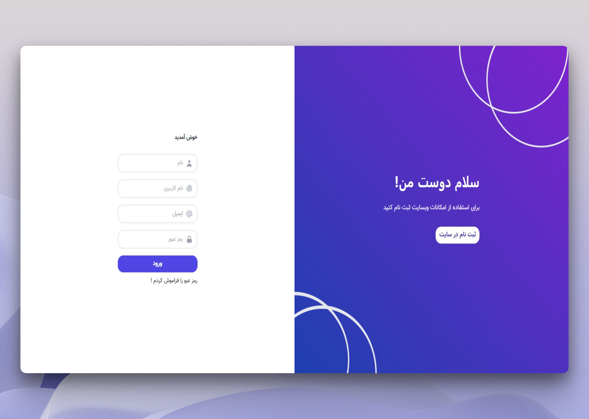

# RTL form

This is an responsive form with RTL direction.

Users should be able to:

- See hover and focus states for all interactive elements on the page

### Built with

- Semantic HTML5 markup
- CSS custom properties
- Flexbox
- TailwindCSS

